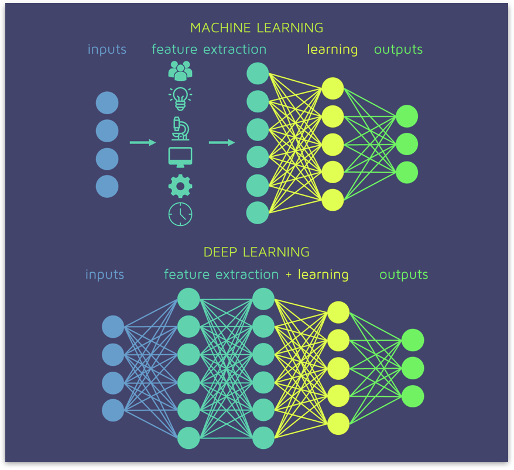

# 人工智能的基础概念

* 什么是人工智能

	+ 达特茅斯会议 (1956 年) - 什么是 AI

		- 1956 年 - 人工智能元年。1956 年提出了人工智能这个概念
		- 约翰·麦卡锡（John McCarthy）、马文·闵斯基（Marvin Minsky，人工智能与认知学专家）、克劳德·香农（Claude Shannon，信息论的创始人）、艾伦·纽厄尔（Allen Newell，计算机科学家）、赫伯特·西蒙（Herbert Simon，诺贝尔经济学奖得主）等科学家
		- Artificial Intelligence: Every aspect of learning or any other feature of **intelligence** can be so precisely described that a machine can be made to **simulate** it. (1956)

			> 其中有两个要点: 一个强调智能（智慧），一个强调机器能够模拟它

	+ 图灵测试 - 如何验证一个机器是否具有智能

		- 用于“定义”什么是什么是智能（智慧）。智能（智慧）是一个非常难以定义的事情，我们无法量化衡量它，但是我们可以模拟它。
		- 机器和人进行交流，当真正人类区分不出对面是人还是机器的时候，就说这个机器具备了类似人类一样的智能。图灵测试测试的不仅仅是一个机器是否“聪明”或计算力强，它测试的是这个机器是否像人类一样。

	+ 学术界、科学、工程、研发技术角度的 AI

		- 达特茅斯会议和图灵测试都是很宏观的，高层次的概念，定义了什么是 AI 以及如何验证一个机器是否具有智能。但是没有提供具体的解决方法。

		- 一种比较认可的定义
			
			AI 的领域非常的广，从思维上到行为上，从硬件上到软件上，从家用、工业用、商用到是不是像人一样思考或是不是有理性的决策
			
			| ~ | ~ | ~ | ~ | ~ |
			| :----: | :----: | :----: | :----: | :----: |
			|      |      | /\ |     |      |
			|      | **动作是理性的** 如火星车、无人驾驶、工业机器人、四轴飞行器 | 理性的 Rational | **思维是理性的** 如加密、解密、AlphaGo、数据挖掘、股票或走势预测、搜索智能推荐、文本、图片、用户信息的自动聚类 |      |
			| < | 行为 Action | + | 思维 Mind | > |
			|      | **行为像人一样** 如人形机器人 | 向人一样的 Like Human | **思维像人一样** 小冰、机器人心理医生 |      |
			|      |      | \/ |      |      |
			
			目前（2021 年），思维是理性的这个象限是投入最多的。
		      
* 现代人工智能的演化

	+ 搜索问题（40-60s）
		* Search (抽象成搜索问题寻找最优解)
		* Dijkstra 最短路径算法
		* 如地图导航、下棋、IBM 深蓝、简单的推理问题（这些都可以抽象成搜索问题）
	+ 由于计算机的存储容量和计算性能是有极限的，当一个搜索问题的每一步的可能性特别多的时候，计算机就存不下这些可能性了（如围棋）（60-70s）
		* Knowledge Based（只要告诉他们一些规则，他们就会进行一些自动的判断和推理）
		* 如医药问答、行业(电力、银行、保险等)专家系统、语音判断
	+ 但是由于现实场景过于复杂，我们很难将所有的规则都定义清楚。如判断一句话说的对不对，然后对他进行改正的时候，判断一句话对不对很难用一个语法规则来解决。（70-80s）
		* Probability (基于大量的数据和统计，由概率来判断)
		* 如语音识别、自动纠错等更加复杂的决策系统
	+ 但是概率也不能解决很多复杂的问题。如 90 年代，美国建成了信息高速路，使用网络的人普及成了平民，使用人数暴涨，垃圾邮件也暴涨。怎么解决垃圾邮件呢？人们想既然我们算不出一段文本是垃圾邮件的概率 P，为什么不让计算机自己算呢？（让计算机生成一个拟合函数）（80-至今）
		* Learning
		* 如贝叶斯模型、决策树、机器学习、神经网络、深度学习（这些都是拟合函数的方法）

	> 目前有 3/5 的场景依然需要 Search、Knowledge Based 以及 Probability 来解决。这些老的方法是非常重要的。
	>
	> Learning 重要并不是它可以所有的问题，而是它解决了以前难以解决的问题，如图像、语音识别，人脸识别等
			
	- 深度学习
		* AI 包含机器学习，机器学习里有一种方法叫神经网络，神经网路里有一种方法叫深度学习
		* 深度学习有一个假设: **世界上所有的关系都可以抽象成函数**

			> 以下围棋为例，
			> 以前是搜索出很多可能性，找出最有可能取胜的点
			> 我们计算出 f(x) = y （x 是一个 361 维向量，是当前棋盘的棋子的排布，y 是这一步棋之后该怎么走） 把 Search 抽象成了一个函数对应问题
			>
			> 鉴于所以的东西都可以数字化编码，编码之后，我们希望得到这样一个函数，深度学习就是通过观察到的数据拟合成一个比较复杂的函数的方法。如价格预测，识别图像，智能判断等都是深度学习的应用。
		
		* **深度学习的本质是拟合复杂的函数**
		
					
			- Feature Extraction 是获取向量 x 的表示（表征）
			- 每一层都是一个 wx + b 函数（w 是 weight 权重的缩写）
			- 在每一层之后有一个非线性变化：非线性参数(wx + b)
			- 深度学习就是将线性和非线性变化的过程重复了很多次

		* 在深度学习出现之前
		> 在深度学习出现之前: AI or machine learning == My curve is better than yours
		
		* 深度学习成功的原因
			- 良好的模型性能需要数据，需要大量的数据集
			- 互联网 2.0 提供了大量的数据
			- GPU 的发展提供了充足的算力（GPU 就是画图，神经网络的每一层都是做矩阵乘法，GPU 中做的最多的优化就是将矩阵相乘做并行计算） 

			> 神经网络随着数据量的增多，准确度是越来越高的
			> 在 2012 年之前，top 的错误率在 26%，大约每年前进一个百分点，大家预估图像识别这种技术将来会在 2040 年左右才能使用，大约要 26 年。
			> 但是，2012 年，多伦多大学的一些人，利用深度学习，将错误率降到了 16%，一年进步了 10%，从那之后深度学习开始普及。
			> 2015 年左右开始，计算机视觉识别图片的准确度已经超过人类了。政府开始落地人工智能。如人脸识别，智能翻译等。
		
	- 目前人工智能的特点
		* 应用范围广
		* 解决了诸多以前无法解决的问题
		* 持续有更多的领域进行突破
		* 深度学习是主角
		* 需要大量数据
		* 需要大量计算力
		* 经典的方法也占据着重要的位置

* 人工智能的极限和未来
	+ 极限
		+ 推理
		+ 可解释性

* 人工智能和其他领域的关系
	+ 数学，数学是基础（如概率，条件概率，偏导数，矩阵运算）
	+ 机械、自动化（左侧“行为”象限部分需要应用到）
	+ 软件工程
		+ 工程: 如何用最低的代价保质完成
		+ 科学: 探索一种新的方法，解决未知的问题
		+ 对于一个良好的 AI 从业者，工程能力是基础
	+ 英语（专业书、读论文、写论文）

* 为什么 Python 是现代人工智能领域使用最多的语言
	+ 随着机器性能的迅速提升，研发人员的时间成本远远大于机器的成本（Python 缺点: 运算速度慢）
	+ 算法复杂度的优化，大大强于语言本身的优势（优秀的算法提升的速度会大大超过语言的运算性能所带来的速度提升，而算法的设计和优化与语言无关）
	+ Python 对于数学计算和文本处理的良好的支持性
	+ Java，C++ 等已经提供了良好的大数据处理基础

* 人工智能的学习建议
	+ 多练习
	+ 多思考原理
	+ 多多尝试解决新问题